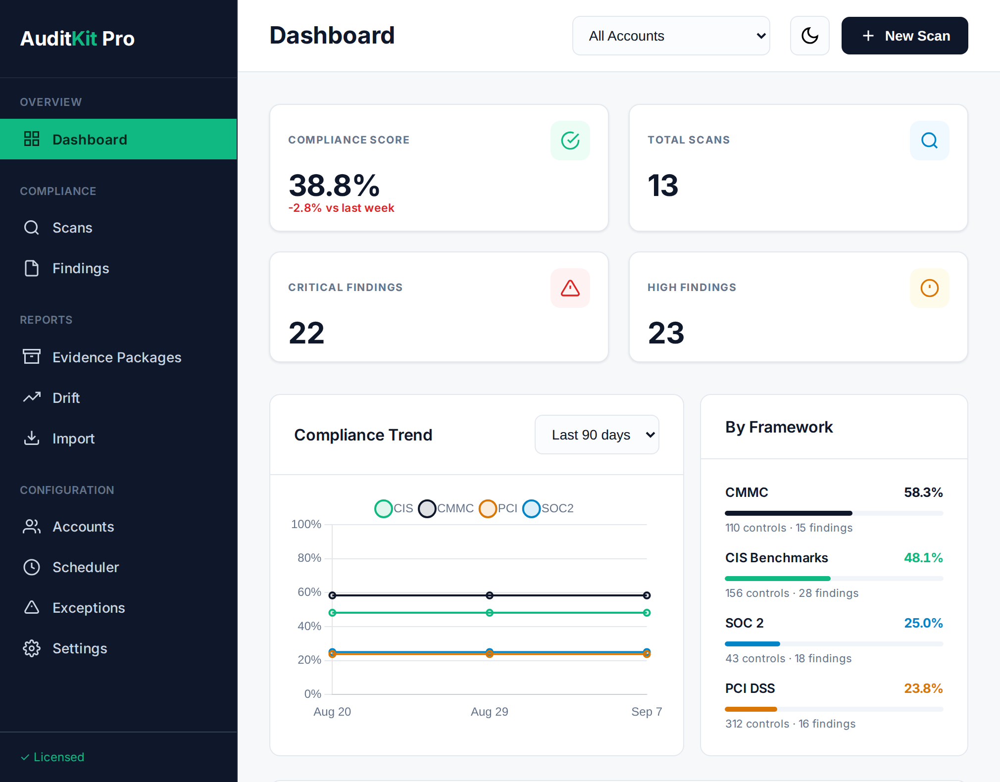
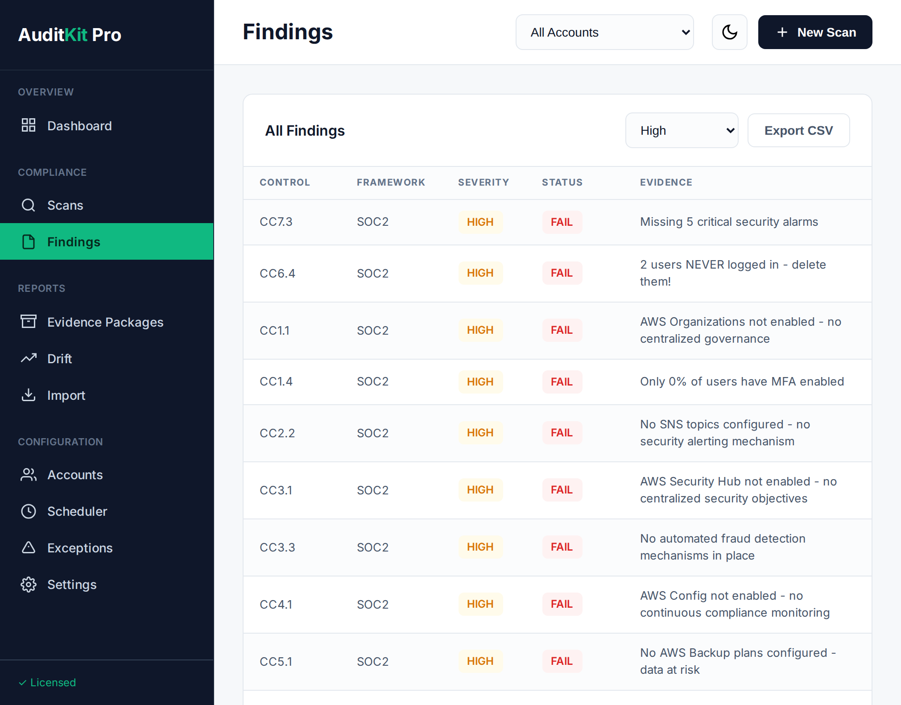
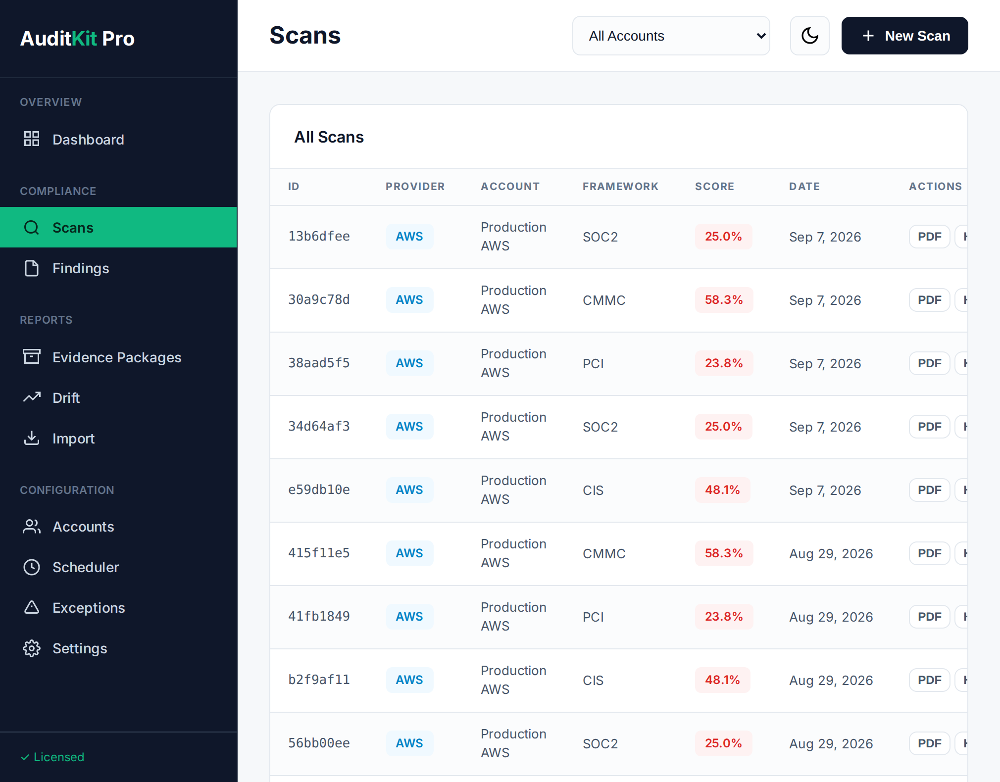

# AuditKit - Open-Source Compliance Scanner

**Scan AWS, Azure and GCP - plus Microsoft 365 via ScubaGear import - against ten frameworks - SOC2, PCI DSS v4.0.1, CMMC Level 1 & 2, HIPAA, NIST 800-53, ISO 27001, NIST CSF 2.0, GDPR, FedRAMP and CIS Benchmarks. Get audit-ready reports in minutes.**

[](https://github.com/guardian-nexus/AuditKit-Community-Edition/stargazers)
[](https://opensource.org/licenses/Apache-2.0)
[](https://github.com/guardian-nexus/AuditKit-Community-Edition/releases)
[](https://guardiannexus.substack.com)

**New in v0.8.7:** `auditkit update` and the provider binaries now report the version they were actually built from.

**CMMC Level 2 is reported in the Community Edition** - all 110 practices, with
Level 1 automated (5 of 17 practices) and the remainder listed with evidence-collection guidance.

**Need automated Level 2 checks, evidence packages, or continuous monitoring?** → [auditkit.io](https://auditkit.io)

---

## Quick Start

```bash
# Install
git clone https://github.com/guardian-nexus/AuditKit-Community-Edition
cd AuditKit-Community-Edition/scanner
go build ./cmd/auditkit

# Scan - swap aws for azure or gcp (and cis-aws for cis-azure or cis-gcp)
./auditkit scan -provider aws -framework soc2          # SOC2 compliance
./auditkit scan -provider aws -framework cis-aws       # CIS security hardening

# Generate reports (PDF, HTML, CSV, JSON)
./auditkit scan -provider aws -framework soc2 -format pdf -output aws-soc2.pdf
```

More in [Example Commands](#example-commands).

**Setup:** [AWS](./site/docs/setup/aws.md) • [Azure](./site/docs/setup/azure.md) • [GCP](./site/docs/setup/gcp.md) • [M365](./site/docs/setup/m365.md)

---

## What It Does

AuditKit scans your cloud infrastructure for compliance gaps and security misconfigurations:

- **Broad Control Coverage:** 228 AWS, 276 Azure and 167 GCP controls assessed - some return an automated verdict, the rest are reported with evidence-collection guidance
- **Full CMMC Scope:** all 110 Level 1 + 2 practices reported, so you see the whole assessment surface
- **Multi-Cloud Support:** AWS, Azure and GCP scanned directly, Microsoft 365 via ScubaGear import
- **Audit-Ready Reports:** PDF/HTML/JSON output with evidence
- **Fix Commands:** Exact CLI/Terraform commands to remediate issues
- **Framework Crosswalk:** One control fix improves multiple frameworks

**What it doesn't do:** Replace auditors, scan for vulnerabilities, or guarantee certification.

**[View Examples →](./site/examples/)** • **[Read Documentation →](./site/docs/)**

---

## Supported Frameworks

### Compliance Frameworks

Counts are distinct criteria, requirements or practices assessed per provider,
measured from the checks themselves.

| Framework | AWS | Azure | GCP | Purpose |
|-----------|-----|-------|-----|---------|
| **SOC2 Type II** | 38 of 43 | 38 of 43 | 32 of 43 | SaaS customer requirements |
| **PCI DSS v4.0.1** | 59 | 63 | 50 | Payment card processing |
| **CMMC Level 1** | 5 of 17 | 4 of 17 | 4 of 17 | DoW contractor compliance (FCI) |
| **CMMC Level 2** | All 110 practices | All 110 practices | All 110 practices | Full Level 2 scope reported with evidence guidance; 6 practices automated on GCP, none on AWS/Azure. Automated Level 2 across all providers in [AuditKit Pro](https://auditkit.io/) |

71 distinct PCI DSS v4.0.1 requirements are assessed across the three providers.

### Derived Frameworks

These are not separate checks. Each is derived from the frameworks above through
the NIST 800-53 crosswalk, so coverage follows from what the scanner already
assessed.

| Framework | AWS | Azure | GCP | Unit |
|-----------|-----|-------|-----|------|
| **NIST 800-53 Rev 5** | 146 | 144 | 141 | controls (149 across all providers) |
| **ISO 27001:2022** | 53 | 53 | 53 | controls |
| **NIST CSF 2.0** | 67 | 65 | 65 | subcategories |
| **HIPAA Security Rule** | 30 | 30 | 30 | safeguards |
| **GDPR** | 16 | 16 | 16 | articles |

FedRAMP Low, Moderate and High are filtered views of the NIST 800-53 coverage
above rather than separate control sets.

### Security Hardening

| Framework | AWS | Azure | GCP | Purpose |
|-----------|-----|-------|-----|---------|
| **CIS Benchmarks** | 70 | 127 | 93 | Industry security best practices |

**[Framework Details →](./site/docs/frameworks/)** • **[What's the difference? →](./site/docs/frameworks/#compliance-vs-security-hardening)**

---

## Community Edition vs AuditKit Pro

This repository is the **Community Edition**: free, open source, and the whole
scanner for AWS, Azure and GCP - with Microsoft 365 via ScubaGear import - against SOC2, PCI DSS, CMMC Level 1 and 2,
and the frameworks derived from them. It is not a trial or a crippled build.

**AuditKit Pro** is a separate paid product for organisations that need
automated CMMC Level 2 checks, an assessor-ready evidence package, estate-wide
scanning, or a desktop interface.

| | Community Edition (free) | AuditKit Pro ($297/mo) |
|---|---|---|
| **Cloud providers** | AWS, Azure, GCP scanned; M365 via ScubaGear import | Same, plus Azure Arc |
| **Controls assessed** | 228 AWS, 276 Azure, 167 GCP | 315 AWS, 394 Azure, 284 GCP |
| **SOC2 Type II** | 38, 37, 32 criteria | 38, 38, 36 criteria |
| **PCI DSS v4.0.1** | 71 requirements | 77 requirements |
| **CMMC Level 1** | 5 of 17 practices automated | 7 of 17 practices automated |
| **CMMC Level 2** | All 110 practices reported for evidence | All 110 reported: 26 reach a pass or fail, 84 carry evidence guidance |
| **CIS Benchmarks** | 70 AWS, 127 Azure, 93 GCP | 70 AWS, 127 Azure, 93 GCP |
| **Derived frameworks** | 800-53, ISO 27001, HIPAA, GDPR, NIST CSF, FedRAMP | Same six, from a larger control set |
| **NIST 800-53 derived** | 149 controls | 151 controls |
| **GDPR / NIST CSF derived** | 16 articles, 67 subcategories (AWS) | 16 articles, 67 subcategories (AWS) |
| **Reports** | PDF, HTML, CSV, JSON | Same |
| **Offline / air-gapped scans** | Yes | Yes, plus cache expiry and clearing |
| **Evidence lifecycle** | Collection tracking | Tracking, plus a packaged audit deliverable |
| **GKE and Vertex AI** | 5 GKE controls | 15 GKE and 10 Vertex AI controls |
| **Multi-account scanning** | - | AWS Organizations, Azure Management Groups, GCP folders, with account, OU and folder selection |
| **Multi-cloud in one run** | - | AWS, Azure and GCP together |
| **Drift detection** | - | Across environments, or between two saved scans |
| **Exceptions and waivers** | - | Tracked with approval and expiry |
| **On-premises** | - | Azure Arc (experimental) |
| **Desktop GUI** | - | Web dashboard at localhost:1337 |
| **Custom controls** | - | Define your own checks in YAML |
| **Scheduled scanning** | - | Daemon with webhook, SMTP and syslog alerting |
| **Support** | GitHub Issues | Priority email, 14-day trial |

Everything in the Community column runs from this repository with no licence key.

**[Compare Features →](./site/pricing.md)** • **[Start Free Trial →](https://auditkit.io/)**

---

## Recent Changes (v0.8.7)

**September 2026**

Version reporting fixes. No scanner, catalog or report changes - coverage is identical to v0.8.6.

Fixes:
- `auditkit update` reported every install as v0.3.0; it now takes its version from the binary it is part of
- Version comparison is numeric, so v0.10.0 is correctly newer than v0.9.0
- The AWS, Azure and GCP binaries reported v0.8.5 while the universal one reported v0.8.6; all four now agree, and `make build` injects the version instead of leaving it unset

### Previous: v0.8.6

**September 2026**

Coverage rebaseline and stability pass.

Changed:
- CMMC reporting covers all 110 Level 1 + 2 practices. Level 1 remains the automated set (13 of 17); the rest are reported with evidence-collection guidance so a scan shows the full assessment scope
- Framework control catalogs are embedded and reported in full: CMMC (110), HIPAA (75), ISO 27001 (93), NIST CSF 2.0 (106), PCI DSS v4.0.1 (312), NIST 800-53 Rev 5 (1196) and FedRAMP Low/Moderate/High (149/287/370)
- FedRAMP baseline membership derives from the NIST 800-53 baselines
- Derived-framework scans run the complete check set, broadening what each can reach through the crosswalk

Refinements:
- CIS coverage rebaselined: AWS 158, Azure 108, GCP 71
- HIPAA catalog aligned to the published Security Rule, and two crosswalk mappings realigned
- Control identifiers normalised across providers
- Offline mode resolves a cached scan without a known account id
- Documentation and site figures regenerated from the code

### Previous: v0.8.5

**September 2026**

Hotfix for v0.8.4 - the v0.8.4 binaries were built before the CMMC corrections below

Fixes:
- CMMC practice ids now match NIST SP 800-171 Rev 2; ten were claiming Level 1 for Level 2 controls
- CMMC Level 1 coverage reads 13 of 17 practices, not 17 - the mislabelling had been inflating it
- Crosswalk keys canonicalised, including four under `RE.L2-3.13.x` where RE is not a family
- NIST 800-53 total corrected from 144 to 96; the old figure counted controls no check can reach
- Site claimed AWS 90+ checks, Azure 64+, GCP 170+ against 229, 178 and 135
- Sample report and Azure Arc page still cited PCI DSS v3.2.1 requirement numbers

Added:
- GDPR and NIST CSF 2.0 documentation pages; both returned results in v0.8.4 with nothing written about them
- `check-cmmc.py` rejects non-conforming practice ids in CI
- `coverage-counts.py` derives every documented count from the code and fails CI on drift

### Previous: v0.8.4

**September 2026**

Scores will drop after upgrading - absent resources and unreadable resources no longer count as passes (55.0% to 30.8% on our test account, same environment)

Fixes:
- Controls for resource types an account does not use are excluded from the score instead of passing vacuously (89 checks)
- Checks that cannot read a resource no longer report a verdict about it
- PCI requirements now resolve to NIST 800-53: 69 of 69, was 19 of 97
- Macie, Security Hub, Inspector and GCP OS Login remapped to what they actually evidence
- `evidence import` works - it consumed its own path argument and failed on every invocation
- PCI password check demanded 12 characters while its remediation told you to set 7
- Scans that evaluate nothing exit non-zero instead of reporting 0%

Added:
- SOC2 Availability and Confidentiality criteria (A1.1-A1.3, C1.1, C1.2) on AWS, Azure and GCP
- PCI DSS v4.0.1 requirements mandatory since 31 March 2025 on all three providers
- Evidence lifecycle with staleness tracking - `evidence status`, `evidence collect`, `evidence import`
- GDPR and NIST CSF 2.0 return results, both previously returned nothing

### Previous: v0.8.3

**August 2026**

Fixes:
- Compliance score in PDF/HTML reports now matches the CLI (manual controls were counted as automated)
- Manual controls now appear in reports - 45 were being dropped from the evidence guide entirely
- M365 scans now score on the same basis as other providers
- Fixed all binary download URLs in the installation guide and CI/CD examples (previously 404)
- Added Linux ARM64 and Apple Silicon installation instructions
- Provider-specific binaries now report the correct version (were pinned at v0.7.0)
- Release archives dropped the version from filenames so `releases/latest/download/` links keep working
- `go vet` and `go test ./...` pass again

Scores may read higher than v0.8.2 on scans with manual controls. Pass/fail results are unchanged.

### Earlier releases

Full notes for every release, including v0.8.2 and earlier (January - February
2026), are in the
**[GitHub releases →](https://github.com/guardian-nexus/AuditKit-Community-Edition/releases)**

---

## AuditKit Pro Desktop

*This section describes AuditKit Pro, the paid product. It is not part of the
Community Edition and is not built from this repository.*

AuditKit Pro includes a web-based dashboard that runs locally on your machine.



### Desktop Features
- **Visual Dashboard** - Real-time compliance scores and trends
- **Scan History** - Browse all past scans with search and filtering
- **Findings Explorer** - Searchable table of all findings with severity filtering
- **Evidence Packages** - Generate audit-ready ZIP files from the browser
- **Exception Management** - Track waivers and compensating controls with full CRUD
- **Drift Detection** - Visual comparison of scans to identify configuration changes
- **Continuous Monitoring** - Schedule recurring scans with cron-style scheduling
- **100% Offline** - Runs locally, no cloud dependencies, air-gap compatible

### Screenshots

| Dashboard | Findings | Scan History |
|-----------|----------|--------------|
|  |  |  |

### Quick Start (Desktop)
```bash
# Save your .lic file (received after purchase/trial signup)
mkdir -p ~/.auditkit-pro
cp ~/Downloads/license.lic ~/.auditkit-pro/license.lic

# Run — activation is automatic on first run
./auditkit-pro-desktop

# Browser opens automatically to http://localhost:1337
# Change port if needed: ./auditkit-pro-desktop --port 8080

# Legacy method (deprecated): export AUDITKIT_PRO_LICENSE="AKP-..."
```

**[Learn More →](https://auditkit.io/)** • **[Start 14-Day Trial →](https://buy.stripe.com/28E14m5MS5xM0mj4r7gnK01)**

---

## Why Use AuditKit?

**For Startups:** Free SOC2 prep without $50K consultants  
**For Security Teams:** CIS Benchmarks for proactive hardening  
**For DoW Contractors:** Full CMMC Level 1 + 2 scope reported free - [automated Level 2 across all providers in Pro](https://auditkit.io/)  
**For Multi-Cloud:** Single tool for AWS + Azure + GCP, with M365 via ScubaGear import  
**For DevOps:** JSON output for CI/CD integration

---

## Installation

### Pre-built Binaries
Download from [GitHub Releases](https://github.com/guardian-nexus/AuditKit-Community-Edition/releases)

### From Source

**Option 1: Universal Scanner (All Clouds)**
```bash
git clone https://github.com/guardian-nexus/AuditKit-Community-Edition
cd AuditKit-Community-Edition/scanner
go build ./cmd/auditkit
./auditkit scan -provider aws -framework soc2
```

**Option 2: Provider-Specific Scanners (Smaller Binaries)**
```bash
# AWS-only scanner (~93% smaller: 22 MB vs 310 MB)
go build -o auditkit-aws ./cmd/auditkit-aws
./auditkit-aws scan -framework soc2

# Azure-only scanner
go build -o auditkit-azure ./cmd/auditkit-azure
./auditkit-azure scan -framework soc2

# GCP-only scanner
go build -o auditkit-gcp ./cmd/auditkit-gcp
./auditkit-gcp scan -framework soc2
```

**Requirements:**
- Go 1.24+ (matching `scanner/go.mod`)
- Cloud credentials configured (AWS CLI, Azure CLI, gcloud CLI)
- Read-only permissions (no write access needed)

**[Full Installation Guide →](./site/docs/installation.md)**

---

## Example Commands

### Compliance Scanning (All Clouds)
```bash
# AWS scans
./auditkit scan -provider aws -framework soc2       # SOC2 Type II
./auditkit scan -provider aws -framework pci        # PCI-DSS v4.0
./auditkit scan -provider aws -framework cmmc       # CMMC Level 1 + 2 (110 practices)
./auditkit scan -provider aws -framework 800-53     # NIST 800-53 Rev 5

# Azure scans
./auditkit scan -provider azure -framework soc2     # SOC2 Type II
./auditkit scan -provider azure -framework pci      # PCI-DSS v4.0
./auditkit scan -provider azure -framework cmmc     # CMMC Level 1

# GCP scans
./auditkit scan -provider gcp -framework soc2       # SOC2 Type II
./auditkit scan -provider gcp -framework pci        # PCI-DSS v4.0
./auditkit scan -provider gcp -framework cmmc       # CMMC Level 1
```

### Security Hardening (CIS Benchmarks)
```bash
./auditkit scan -provider aws -framework cis-aws      # CIS AWS (158 controls)
./auditkit scan -provider azure -framework cis-azure  # CIS Azure (108 controls)
./auditkit scan -provider gcp -framework cis-gcp      # CIS GCP (71 controls)
```

### Report Generation
```bash
# PDF reports
./auditkit scan -provider aws -framework soc2 -format pdf -output aws-soc2.pdf
./auditkit scan -provider azure -framework pci -format pdf -output azure-pci.pdf
./auditkit scan -provider gcp -framework cmmc -format pdf -output gcp-cmmc.pdf

# HTML reports (interactive)
./auditkit scan -provider aws -framework cis-aws -format html -output cis-report.html

# JSON (for CI/CD pipelines)
./auditkit scan -provider gcp -framework all -format json -output compliance.json

# CSV (for spreadsheets)
./auditkit scan -provider azure -framework soc2 -format csv -output azure-soc2.csv
```

### Provider-Specific Scanners
```bash
# Using provider-specific binaries (smaller, faster)
./auditkit-aws scan -framework soc2 -format pdf -output aws-soc2.pdf
./auditkit-azure scan -framework pci -format html -output azure-pci.html
./auditkit-gcp scan -framework cmmc -format json -output gcp-cmmc.json
```

### External Tool Integration
```bash
# Import Prowler results
prowler aws --output-formats json -o prowler-output     # Run Prowler first
./auditkit integrate -source prowler -file prowler-output.json

# Import with PDF report
./auditkit integrate -source prowler -file prowler.json -format pdf -output prowler-report.pdf

# Import ScubaGear M365 results
./auditkit integrate -source scubagear -file scubagear-results.json
```

### Remediation Scripts
```bash
# Generate fix scripts (review before running!)
./auditkit fix -provider aws      # AWS remediation script
./auditkit fix -provider azure    # Azure remediation script
./auditkit fix -provider gcp      # GCP remediation script
```

**[CLI Reference →](./site/docs/cli-reference.md)**

---

## Documentation

### Getting Started
- **[Quick Start Guide](./site/docs/getting-started.md)** - First scan in 5 minutes
- **[Cloud Provider Setup](./site/docs/setup/)** - AWS, Azure, GCP, M365 authentication
- **[Understanding Results](./site/docs/getting-started.md#understanding-your-results)** - Pass/Fail/Info status explained

### Frameworks
- **[SOC2 Type II](./site/docs/frameworks/soc2.md)** - Trust Services Criteria
- **[PCI-DSS v4.0](./site/docs/frameworks/pci-dss.md)** - Payment card security
- **[CMMC](./site/docs/frameworks/cmmc.md)** - DoW contractor compliance
- **[CIS Benchmarks](./site/docs/frameworks/cis-benchmarks.md)** - Security hardening
- **[NIST 800-53](./site/docs/frameworks/nist-800-53.md)** - Federal requirements
- **[All Frameworks →](./site/docs/frameworks/)**

### Examples & Use Cases
- **[Sample Reports](./site/examples/)** - See what output looks like
- **[Sample Scan Outputs](./site/examples/scan-outputs/)** - Real findings with their fix commands
- **[CI/CD Integration](./site/examples/cicd.md)** - Automate compliance checks

### Reference
- **[CLI Reference](./site/docs/cli-reference.md)** - All commands and flags
- **[FAQ](./site/docs/faq.md)** - Common questions
- **[Troubleshooting](./site/docs/faq.md#troubleshooting)** - Known issues and fixes

---

## CIS Benchmarks Explained

**What is CIS?** The Center for Internet Security publishes security configuration best practices used by organizations worldwide.

**Why add CIS to AuditKit?** 
- **Proactive security:** CIS catches misconfigurations before they become incidents
- **Complements compliance:** SOC2/PCI/CMMC focus on audit requirements; CIS focuses on technical hardening
- **Industry standard:** CIS Benchmarks are referenced by cyber insurance, security frameworks, and auditors

**Example:** Your AWS account might pass SOC2 compliance but still have security gaps that CIS would catch (weak password policies, unnecessary services enabled, missing encryption).

**[Learn more about CIS →](./site/docs/frameworks/cis-benchmarks.md)**

---

## Contributing

We need help with:
- **CIS Azure & GCP expansion** (add more controls to existing implementations)
- **Additional framework mappings** (ISO 27001 expansion)
- **FedRAMP baseline filtering** for Low/Moderate/High
- **Kubernetes compliance** scanning
- **Automated evidence collection** workflows
- **Additional Prowler mappings** (expand framework coverage for imported findings)

**[Contributing Guide →](./CONTRIBUTING.md)** • **[Good First Issues →](https://github.com/guardian-nexus/AuditKit-Community-Edition/issues?q=is%3Aissue+is%3Aopen+label%3A%22good+first+issue%22)**

---

## Support

- **Community Support:** [GitHub Issues](https://github.com/guardian-nexus/AuditKit-Community-Edition/issues)
- **Security Issues:** [SECURITY.md](./SECURITY.md)
- **Newsletter:** [guardiannexus.substack.com](https://guardiannexus.substack.com)
- **AuditKit Pro Support:** Priority email, 24-48 hour response (info@auditkit.io)

---

## License

Apache 2.0 - Use freely, even commercially. See [LICENSE](./LICENSE) for details.

---

## About Guardian Nexus

AuditKit is built by current defense sector professionals with deep expertise in compliance and cloud security. We ship working software monthly instead of enterprise vaporware.

**Our Background:**
- Active security clearance holders
- 15+ years in defense sector compliance
- Former and current defense contractor (understand CMMC pain firsthand)
- Built compliance tools used by Fortune 500 companies

**Our Philosophy:**
- Ship features, not promises
- Open source first, paid tier for advanced needs
- Documentation that doesn't suck
- Responsive support (we actually read your issues)

**Questions?** Email: hello@auditkit.io
